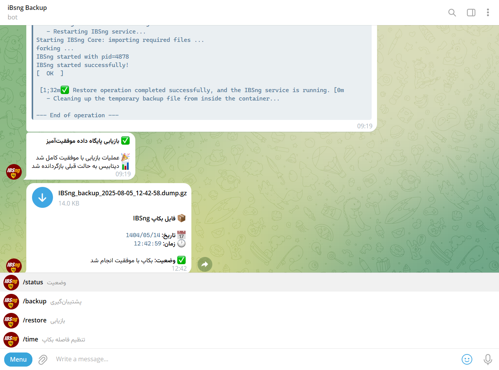

# نصب آسان پنل iBsng روی Ubuntu 22.04

<div dir="rtl">

## 🌟 معرفی

این پروژه یک راهکار کامل و خودکار برای **نصب، مدیریت و پشتیبان‌گیری از سرویس IBSng** با استفاده از Docker است که با یک ربات تلگرام ادغام شده است. با این ابزار می‌توانید به راحتی سرویس IBSng را راه‌اندازی کرده و از پایگاه داده آن به صورت منظم و خودکار نسخه پشتیبان تهیه کنید. فایل‌های پشتیبان به طور مستقیم به چت تلگرام شما ارسال می‌شوند و شما می‌توانید از طریق دستورات ربات، عملیات پشتیبان‌گیری و بازیابی را مدیریت کنید.

شایان ذکر است این پنل برای همگام‌سازی کامل با هر دو سرویس **[Ocserv](https://github.com/ArashAfkandeh/Ocserv-Installer)** و **[OpenVPN](https://github.com/ArashAfkandeh/OpenVPN-Installer)** (که ریپازیتوری‌های نصب آسان آن‌ها در گیت‌هاب من در دسترس است) بهینه‌سازی شده است تا بتواند از هر دو قابلیت احراز هویت (Authentication) و حسابرسی (Accounting) به صورت کامل پشتیبانی کند.

## 🎯 ویژگی‌های کلیدی

- ✅ **نصب تمام خودکار**: اسکریپت نصب هوشمند که تمام پیش‌نیازها از جمله Docker، Docker Compose و ابزارهای Python را بر روی سرور شما نصب می‌کند.
- ⚙️ **پیکربندی تعاملی**: در هنگام نصب، پورت‌های مورد نیاز (وب، RADIUS)، دامنه‌ها و اطلاعات ربات تلگرام به صورت تعاملی از شما دریافت می‌شود.
- 🌐 **پشتیبانی از دو دامنه (Direct & Tunnel)**: امکان تعریف همزمان دو دامنه مجزا (دامنه مستقیم و دامنه تونل) برای دسترسی به پنل مدیریت.
- 🔒 **تأمین امنیت با SSL خودکار**: نصب و پیکربندی خودکار وب‌سرور Caddy به عنوان ریورس پروکسی جهت دریافت و تمدید خودکار گواهی SSL رایگان (Let's Encrypt) برای دامنه‌های متصل شده.
- 💾 **ذخیره‌سازی پایدار داده‌ها**: تمامی اطلاعات پایگاه داده PostgreSQL در مسیر `/opt/ibsng/pgsql` بر روی هاست ذخیره می‌شود تا با حذف یا آپدیت کانتینر از بین نرود.
- 👥 **پشتیبانی از چند ادمین (Multi-Admin)**: امکان ارسال همزمان فایل‌های پشتیبان به چندین شناسه تلگرام و قابلیت تعامل ربات با بیش از یک کاربر مجاز.
- 🛡️ **جلوگیری از محدودیت‌های تلگرام (Rate Limit Delay)**: ایجاد تأخیر زمانی هوشمند مابین ارسال فایل‌ها به شناسه‌های مختلف جهت جلوگیری از نقض قوانین ضد اسپم تلگرام.
- 🤖 **ادغام کامل با تلگرام**:
  - **ارسال خودکار بکاپ**: فایل‌های پشتیبان به صورت خودکار و با کپشن تاریخ شمسی به چت یا کانال تلگرام شما ارسال می‌شوند.
  - **ربات مدیریتی**: با دستورات ساده به ربات، سرویس خود را مدیریت کنید.
  - **پیکربندی پویا**: حداقل فاصله زمانی بین بکاپ‌ها را مستقیماً از طریق دستورات ربات تغییر دهید.
- 🔄 **پشتیبان‌گیری هوشمند**:
  - **زمان‌بندی خودکار**: بکاپ‌گیری در فواصل زمانی مشخص (قابل تنظیم) به صورت خودکار انجام می‌شود.
  - **کنترل فاصله زمانی**: جلوگیری از بکاپ‌های مکرر برای حفظ منابع سیستم.
  - **بکاپ‌گیری دستی**: هر زمان که بخواهید، با دستور `/backup` یک نسخه پشتیبان جدید ایجاد کنید.
- 🚀 **بازیابی آسان و سریع**:
  - **بازیابی از طریق تلگرام**: فایل بکاپ را برای ربات ارسال کنید تا عملیات بازیابی به صورت خودکار انجام شود.
  - **شناسایی هوشمند فرمت**: اسکریپت به طور خودکار فرمت‌های مختلف بکاپ (`.dump.gz` سفارشی یا `.bak` متنی) را تشخیص می‌دهد.
- 📊 **بررسی وضعیت**: با دستور `/status` از وضعیت آخرین بکاپ و زمان آن مطلع شوید.
- 🛡️ **سرویس پایدار Systemd**: اسکریپت پشتیبان‌گیری به عنوان یک سرویس دائمی (`ibsng-backup.service`) در پس‌زمینه اجرا می‌شود تا همیشه فعال بماند و در صورت بروز مشکل به طور خودکار ری‌استارت شود.
- 🧱 **پیکربندی خودکار فایروال**: در صورت فعال بودن UFW، پورت‌های مورد نیاز وب، RADIUS و پورت‌های وب‌سرور Caddy (۸۰ و ۴۴۳) به طور خودکار باز می‌شوند.
- 🗑️ **مدیریت خودکار فایل‌ها**: فایل‌های بکاپ محلی پس از ارسال موفق به تلگرام به طور خودکار حذف می‌شوند تا فضای دیسک اشغال نشود.

## 📋 نیازمندی‌ها

- **سیستم عامل**: **Ubuntu 22.04**
- **دسترسی**: دسترسی `root` یا کاربری با دسترسی `sudo`.
- **دامنه‌ها (اختیاری)**: دامنه‌های مورد نظر برای Direct و Tunnel باید از قبل به آی‌پی سرور متصل (Point) شده باشند تا گواهی SSL با موفقیت فعال شود.

## ⚡ نصب و راه‌اندازی

برای نصب، دستور زیر را در ترمینال سرور خود اجرا کنید. این دستور اسکریپت نصب را دانلود و اجرا می‌کند:

```bash
curl -sSL https://raw.githubusercontent.com/ArashAfkandeh/iBsng-Installer/main/install_ibsng.sh | sudo bash
```

### مراحل نصب چه کاری انجام می‌دهد؟

1.  **بررسی دسترسی**: اطمینان از اجرای اسکریپت با دسترسی `root`.
2.  **نصب پیش‌نیازها**: نصب Docker، Docker Compose، Git، Python، وب‌سرور Caddy و سایر بسته‌های ضروری.
3.  **پیکربندی تعاملی**: دریافت اطلاعات پورت‌های وب و RADIUS، دامنه‌های مستقیم و تونل، و توکن و شناسه چت ربات تلگرام. (برای وارد کردن چندین شناسه چت، آن‌ها را با ویرگول جدا کنید. همچنین برای رد کردن هر بخش می‌توانید Enter بزنید).
4.  **راه‌اندازی کانتینر**: دانلود ایمیج IBSng و راه‌اندازی آن در حالت Bridge به همراه نگاشت پورت‌ها (Port Mapping) به کمک `docker-compose`.
5.  **تنظیم ریورس پروکسی**: پیکربندی خودکار فایل `Caddyfile` برای دامنه‌های وارد شده جهت هدایت امن ترافیک به پنل وب و فعال‌سازی SSL.
6.  **ایجاد سرویس بکاپ**: ساخت و فعال‌سازی یک سرویس `systemd` به نام `ibsng-backup.service` برای اجرای دائمی اسکریپت مدیریت بکاپ.
7.  **پیکربندی فایروال**: باز کردن پورت‌های انتخابی و پورت‌های وب‌سرور (۸۰ و ۴۴۳ برای Caddy) در صورت فعال بودن فایروال `UFW`.
8.  **نمایش اطلاعات نهایی**: نمایش لینک‌های دسترسی امن (HTTPS) متناسب با دامنه‌های تعریف شده و آدرس مستقیم آی‌پی به همراه پورت‌ها.

### نصب غیرتعاملی (Non-Interactive)

برای نصب خودکار بدون سوالات تعاملی، می‌توانید تمام پارامترها را مستقیماً در خط فرمان به اسکریپت ارسال کنید.

**فرمت کلی دستور:**

```bash
curl -sSL https://raw.githubusercontent.com/ArashAfkandeh/iBsng-Installer/main/install_ibsng.sh | sudo bash -s -- [WEB_PORT] [AUTH_PORT] [ACCT_PORT] [TOKEN] [CHAT_ID(S)] [DOMAIN_DIRECT] [DOMAIN_TUNNEL]
```

**مثال کامل (با چندین شناسه چت تلگرام):**

```bash
curl -sSL https://raw.githubusercontent.com/ArashAfkandeh/iBsng-Installer/main/install_ibsng.sh | sudo bash -s -- '80' '1812' '1813' '123456:ABC-DEF123456' '1234567891,1987654321' 'direct.example.com' 'tunnel.example.com'
```

**توضیح پارامترها:**

| پارامتر | توضیحات | مقدار پیش‌فرض |
| :--- | :--- | :--- |
| `WEB_PORT` | پورت TCP برای دسترسی به پنل وب IBSng (در صورت استفاده از دامنه، پورت هاست به طور خودکار تغییر می‌کند تا تداخلی با Caddy ایجاد نشود). | `80` |
| `AUTH_PORT` | پورت UDP برای احراز هویت کاربران (RADIUS Authentication). | `1812` |
| `ACCT_PORT` | پورت UDP برای حسابرسی (RADIUS Accounting). | `1813` |
| `TOKEN` | توکن ربات تلگرام شما. | (خالی) |
| `CHAT_ID(S)` | شناسه یا شناسه‌های چت (عددی) کاربران یا کانال‌هایی که بکاپ‌ها به آن‌ها ارسال می‌شود (شناسه‌ها را با ویرگول `,` از هم جدا کنید). | (خالی) |
| `DOMAIN_DIRECT` | دامنه مستقیم جهت اتصال و ساخت پروتکل HTTPS. | (خالی) |
| `DOMAIN_TUNNEL` | دامنه تونل جهت اتصال و ساخت پروتکل HTTPS. | (خالی) |

**نکات مهم:**
- اگر پارامتری را ارائه ندهید، مقدار پیش‌فرض آن استفاده خواهد شد.
- برای رد شدن از هر پارامتر و استفاده از پیش‌فرض آن در نصب غیرتعاملی، می‌توانید از دو کوتیشن خالی (`''`) استفاده کنید.

## 🛠️ پیکربندی ربات تلگرام

اگر در حین نصب اطلاعات ربات را وارد نکرده‌اید یا قصد تغییر و افزودن شناسه‌های جدید را دارید، فایل زیر را ویرایش کنید:

**مسیر فایل:** `/opt/ibsng/backup_ibsng/config.json`

محتوای فایل باید به شکل زیر باشد (برای افزودن چند ادمین، شناسه‌ها را به عنوان عضو آرایه `"chat_ids"` مشخص کنید):

```json
{
    "bot_token": "TELEGRAM_BOT_TOKEN",
    "chat_ids": [
        1234567891,
        1987654321
    ],
    "min_interval_hours": 24,
    "last_backup": 1754370577.5221798
}
```

- `bot_token`: توکن ربات تلگرام که از [@BotFather](https://t.me/BotFather) دریافت می‌کنید.
- `chat_ids`: آرایه‌ای از شناسه‌های عددی چت، کاربران یا کانال‌هایی که می‌خواهید بکاپ‌ها به آن‌ها ارسال شده و مجاز به استفاده از دستورات ربات باشند (برای دریافت شناسه به [@chatIDrobot](https://t.me/chatIDrobot) مراجعه کنید).

پس از ذخیره فایل، سرویس بکاپ را ریستارت کنید تا تغییرات اعمال شوند:

```bash
sudo systemctl restart ibsng-backup.service
```

## 🎮 دستورات ربات تلگرام

شما می‌توانید با ارسال دستورات زیر به ربات تلگرام خود، سرویس را مدیریت کنید. **توجه**: این دستورات فقط برای کاربرانی که شناسه‌های آن‌ها در لیست `"chat_ids"` در فایل کانفیگ ثبت شده، قابل استفاده و پاسخگویی است.

| دستور | توضیحات |
| :--- | :--- |
| `/start` | **راهنمای شروع**: پیام خوش‌آمدگویی و لیست کامل دستورات فعال برای کاربران مجاز را نمایش می‌دهد. |
| `/status` | **نمایش وضعیت**: زمان آخرین بکاپ، حداقل فاصله زمانی تنظیم شده بین بکاپ‌ها و تعداد ادمین‌های مجاز را نمایش می‌دهد. |
| `/backup` | **شروع عملیات پشتیبان‌گیری دستی**: بلافاصله یک نسخه پشتیبان جدید از پایگاه داده تهیه و برای تمامی ادمین‌های مجاز ارسال می‌کند. |
| `/restore` | **شروع عملیات بازیابی**: ربات از شما می‌خواهد فایل بکاپ (`.dump.gz` یا `.bak`) را ارسال کنید تا پایگاه داده را بازیابی کند. |
| `/time <ساعت>` | **تنظیم فاصله بکاپ**: حداقل فاصله زمانی بین بکاپ‌های خودکار را (به ساعت) تغییر می‌دهد. مثال: `/time 8` |
| `/cancel` | **لغو عملیات**: فرآیند بازیابی را در صورتی که منتظر دریافت فایل باشد، لغو می‌کند. |

### نمونه تعامل با ربات

**نمای ربات:**



**درخواست بکاپ دستی:**

> **User:** `/backup`
>
> **Bot:** `🔄 در حال شروع عملیات بکاپ‌گیری...`
>
> **Bot:** _(فایل بکاپ با کپشن تاریخ و زمان به تمام ادمین‌ها ارسال می‌شود)_

**درخواست بازیابی:**

> **User:** `/restore`
>
> **Bot:** `⚠️ هشدار بسیار مهم: ... لطفاً فایل بکاپ معتبر را ارسال کنید.`
>
> **User:** _(فایل `IBSng_backup_2024-01-01.dump.gz` را ارسال می‌کند)_
>
> **Bot:** `🔄 در حال شروع عملیات بازیابی دیتابیس...`
>
> **Bot:** _(گزارش مراحل بازیابی را ارسال می‌کند)_
>
> **Bot:** `✅ بازیابی پایگاه داده با موفقیت انجام شد!`

## 🌐 مدیریت دامنه‌ها در Caddy (افزودن دامنه جدید)

اگر پس از نصب مایل بودید دامنه جدیدی را به وب‌سرور Caddy اضافه کنید تا پنل مدیریت از طریق آن نیز در دسترس باشد، مراحل زیر را دنبال کنید:

1. **ویرایش فایل پیکربندی Caddy:**
   فایل پیکربندی را باز کنید:
   ```bash
   sudo nano /etc/caddy/Caddyfile
   ```

2. **افزودن دامنه جدید:**
   شما می‌توانید دامنه جدید خود را به یکی از دو روش زیر تعریف کنید:

   - **روش اول (ایجاد بلاک مجزا — پیشنهاد شده):**
     ```caddyfile
     DOMAIN.DIRECT.COM {
         reverse_proxy 127.0.0.1:80
     }

     DOMAIN.TUNNEL.COM {
         reverse_proxy 127.0.0.1:80
     }
     ```

3. **اعمال تغییرات:**
   فایل را ذخیره کرده و ببندید (در ویرایشگر nano کلیدهای `Ctrl+O` و سپس `Enter` و بعد `Ctrl+X`). سپس برای بازنشانی و لود شدن دامنه‌های جدید بدون قطعی در سرویس، دستور زیر را اجرا کنید:
   ```bash
   sudo systemctl reload caddy
   ```

## 🔧 مدیریت سرویس

### مدیریت سرویس بکاپ (ibsng-backup.service)

- **مشاهده وضعیت سرویس:**
  ```bash
  sudo systemctl status ibsng-backup.service
  ```
- **مشاهده لاگ‌های سرویس بکاپ:**
  ```bash
  journalctl -u ibsng-backup.service -f
  ```
- **ری‌استارت کردن سرویس:**
  ```bash
  sudo systemctl restart ibsng-backup.service
  ```

### مدیریت کانتینر IBSng

برای مدیریت کانتینر IBSng، به مسیر `/opt/ibsng` بروید و از دستورات `docker compose` استفاده کنید:

```bash
cd /opt/ibsng
```

- **مشاهده لاگ‌های کانتینر IBSng:**
  ```bash
  docker compose logs -f
  ```
- **متوقف کردن سرویس IBSng:**
  ```bash
  docker compose down
  ```
- **راه‌اندازی مجدد سرویس IBSng:**
  ```bash
  docker compose up -d
  ```

## 📄 مجوز (License)

این پروژه تحت مجوز **MIT** منتشر شده است. برای اطلاعات بیشتر فایل `LICENSE` را مطالعه کنید.

</div>
```
